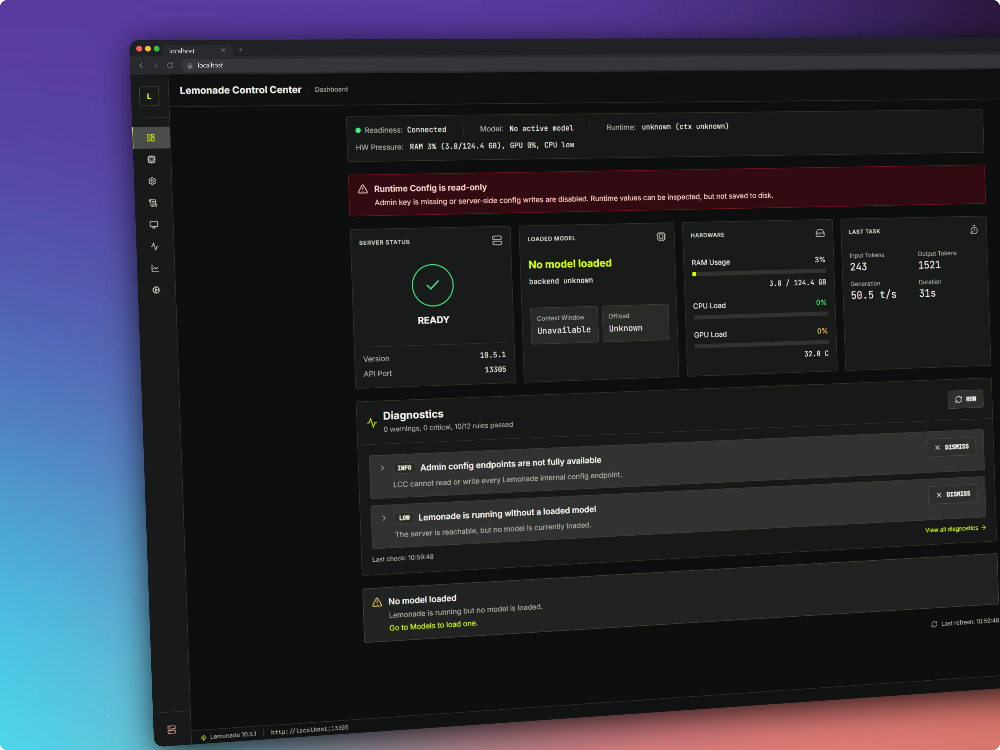
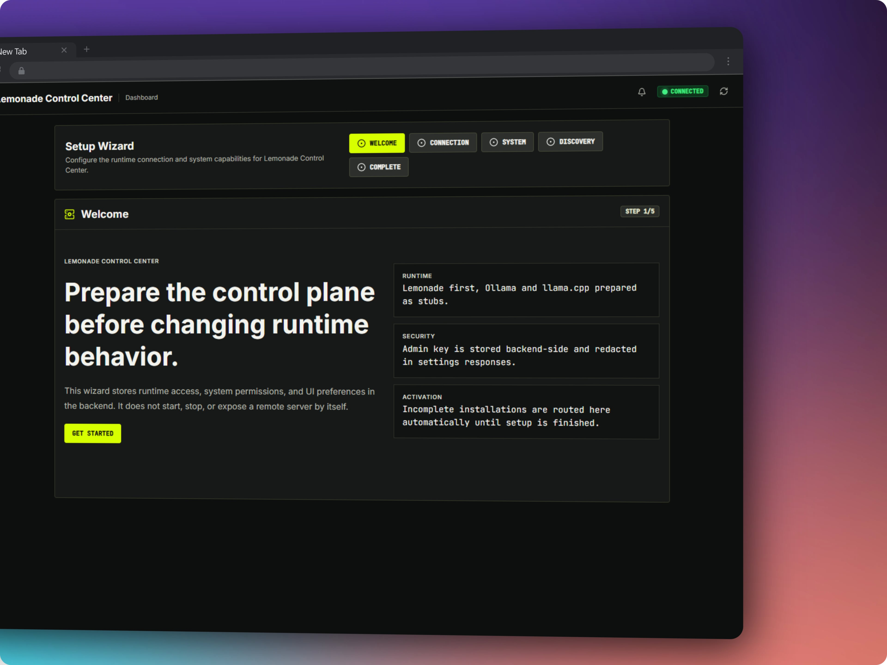
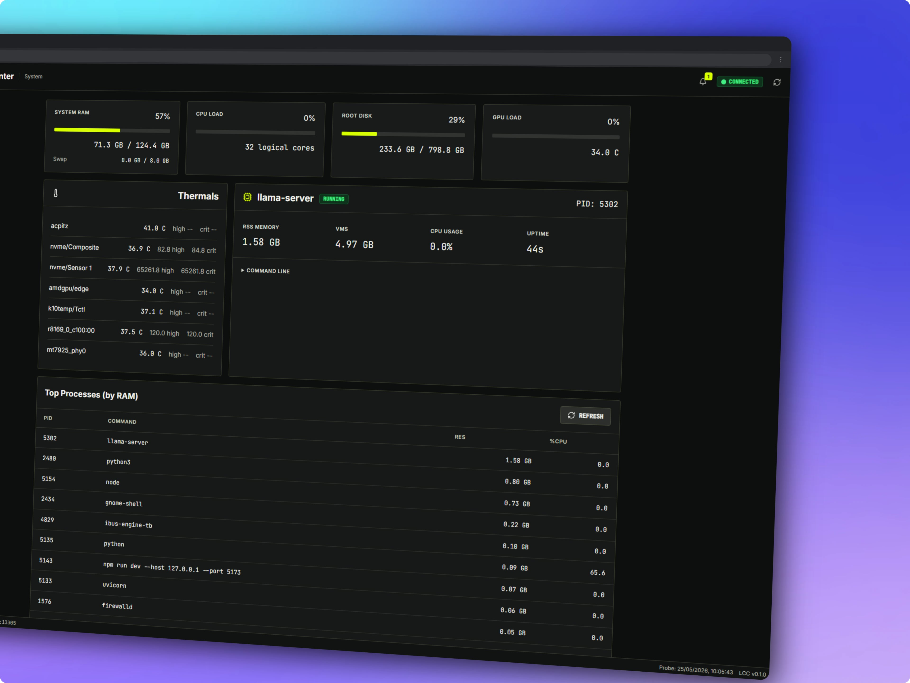
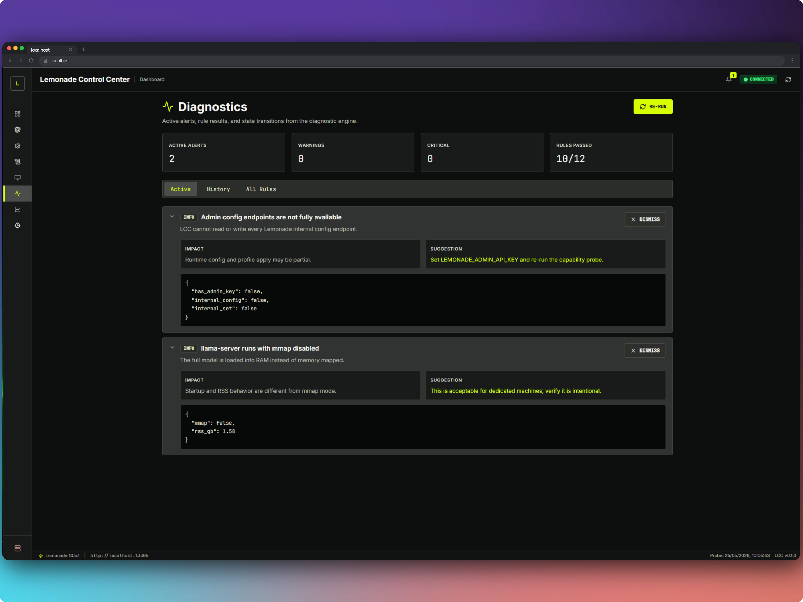
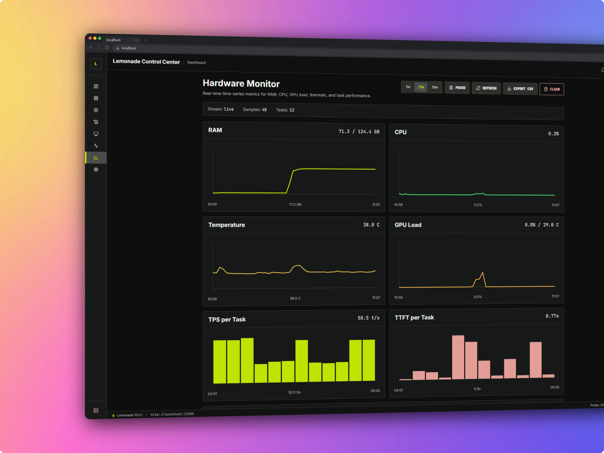

# Lemonade Control Center

> A browser-based operator console for [Lemonade](https://github.com/lemonade-sdk/lemonade), built for Linux inference servers and workstations.

[](LICENSE)


Running local models is the enjoyable part. Operating the server behind them often is not.

I started **Lemonade Control Center (LCC)** because my Lemonade server runs on a Linux AI workstation that I frequently access from another computer. I wanted one place to see what was loaded, understand the settings in use, monitor memory and GPU pressure, inspect failures, and perform routine operations without rebuilding the right terminal command every time.

LCC is that place: a local web dashboard for operating a Lemonade server from a browser.

It is **not a chat interface**. Use Open WebUI, the Lemonade app, or another compatible client to talk to your models. Use LCC to manage and understand the runtime behind them.

## Why LCC?

Lemonade provides a capable server, command-line client, tray application, and desktop app. On Linux, however, `lemond` is also well suited to running as a headless system service. When the inference machine has no display or is managed remotely, desktop tooling is no longer the most convenient operational surface.

The alternative is usually a collection of terminal commands: check the service, inspect the journal, find the active `llama-server` process, monitor memory, load a model with the right options, and remember which settings worked last time.

LCC brings those tasks together without hiding the technical details that matter. Context size, runtime arguments, memory pressure, backend selection, and service state remain visible because changing them can have real consequences. The goal is not to make local inference look simpler than it is, but to make it organized, understandable, and repeatable.

By default, LCC remains local to the Linux host. It can be reached remotely through SSH port forwarding. Direct access from a trusted local network requires an explicit bind-address configuration and appropriate host security.

## Screenshots



| Setup Wizard | System |
|---|---|
|  |  |

| Diagnostics | Hardware Monitor |
|---|---|
|  |  |

## What You Can Do

### See the runtime at a glance

The Dashboard brings together Lemonade health, the active model, recent inference metrics, hardware pressure, and warnings. It answers the basic questions before you start changing anything: what is running, how is the machine behaving, and does something need attention?

### Manage models

The Models workspace provides:

- local model inventory
- access to the remote Lemonade catalog
- model download, load, and unload controls
- active model and process details
- saved Lemonade options
- per-model LCC profiles
- guarded controls for common load options
- an advanced argument field with validation for experienced users

LCC distinguishes between model names exposed through compatibility APIs and the canonical names expected by Lemonade, so routine operations do not depend on users knowing those implementation details.

### Build repeatable configurations

The Configuration workspace separates two different kinds of state:

- **Runtime configuration**, owned by Lemonade and applied when models are loaded.
- **Request defaults**, stored locally by LCC and used as operator preferences.

Built-in profiles provide practical starting points such as Safe, Coding, Long Context, Stress, and Executor Strict. Risky settings remain explicit, and Lemonade-managed arguments are not silently duplicated.

### Read logs as operational information

Logs & Stats turns server output into useful signals:

- input and output tokens
- time to first token
- prompt-processing and generation throughput
- total task duration
- finish reason
- parsed Lemonade logs and warnings
- recent task history

### Monitor the host

LCC monitors the Linux machine that actually runs the models:

- system RAM and swap
- CPU load
- AMD GPU load and temperature when exposed through Linux `sysfs`
- other available thermal sensors through `psutil` or `lm-sensors`
- root-disk usage
- `llama-server` PID, memory use, CPU use, uptime, and command line
- processes with the highest RAM consumption
- `lemond.service` and journal state when systemd is available

On unified-memory systems such as AMD Strix Halo, system RAM is the primary capacity signal. LCC does not currently present a separate VRAM-usage figure.

### Diagnose problems

Diagnostics combines runtime, service, hardware, and configuration checks into one report. It includes warning classification, dismissible findings, diagnostic history, and a downloadable support bundle.

### Configure the connection

Settings manages the Lemonade runtime URL, discovery checks, optional admin API key, local preferences, and project information. Secrets are stored by the backend and redacted from Settings responses.

## Safety Model

LCC is intentionally conservative about privileged and destructive operations.

- The backend binds to `127.0.0.1` by default.
- Model deletion is disabled unless `ENABLE_DELETE=true` is set explicitly.
- Service restart is disabled unless `ENABLE_RESTART=true` is set explicitly.
- Protected Lemonade operations require the Lemonade admin API key.
- Sensitive runtime configuration is excluded from the public repository.
- Destructive actions require confirmation.
- The UI adapts to capabilities detected on the actual machine.

Local inference workloads can consume tens of gigabytes of memory and can make a workstation temporarily unresponsive when configured badly. An operator console for that environment should explain consequences rather than turn every command into an inviting button.

## Architecture

LCC uses two services during development and one service for the real local runtime:

- a **FastAPI backend** for Lemonade integration, host inspection, metrics, profiles, diagnostics, and static frontend serving
- a **SvelteKit frontend** for the browser interface and operator workflows

```text
Browser
   │
   ▼
FastAPI
   ├── /api/*
   ├── /ws/*
   └── built SvelteKit frontend
   ├── Lemonade HTTP API
   ├── systemd / journal
   ├── Linux processes and sysfs
   └── local LCC configuration
```

Development keeps Vite and FastAPI separate for faster iteration. The unified runtime serves the built frontend and the API from the same FastAPI process.

### Backend responsibilities

- Lemonade API integration
- model and catalog operations
- runtime discovery
- profile storage
- hardware and process inspection
- log parsing and metrics collection
- diagnostics and support bundles

### Frontend responsibilities

- application navigation
- runtime and hardware status
- model-management workflows
- configuration and profile editing
- logs, diagnostics, and settings
- confirmations, warnings, and live feedback

## Requirements

- Linux
- Python 3.11 or newer
- Node.js 20 or newer
- a running Lemonade server

Host inspection works best when standard Linux facilities are available, including `systemctl`, `journalctl`, `/proc`, `/sys`, and hardware sensor support.

## Compatibility

LCC is currently tested against Lemonade Server `10.5.1` and `10.7.0` on the primary development workstation. Lemonade `10.7.0` is the current active test target.

Lemonade can change model metadata and server configuration behavior between releases. LCC normalizes the API responses it uses, but new Lemonade versions should still be smoke-tested before relying on them for regular operation.

See [Tested Environment](docs/tested-environment.md) for the current hardware and software baseline.

## Runtime Setup

After cloning the repository, run the installer:

```bash
./install.sh
```

It creates the backend virtual environment, installs backend and frontend dependencies, builds the static frontend, and creates `backend/.env` from `.env.example` when missing.

Start the unified runtime:

```bash
cd backend
source .venv/bin/activate
python -m app.run
```

Open:

```text
http://127.0.0.1:17600
```

FastAPI serves both `/api/*` and the built dashboard. Vite is not needed for this mode.

Manual setup is also possible.

Build the frontend once:

```bash
cd frontend
npm install
npm run build
```

Start the unified runtime:

```bash
cd backend
python -m venv .venv
source .venv/bin/activate
pip install -r requirements.txt
cp ../.env.example .env
python -m app.run
```

## Development Setup

Clone the repository and start the backend:

```bash
cd backend
python -m venv .venv
source .venv/bin/activate
pip install -r requirements.txt
cp ../.env.example .env
uvicorn app.main:app --reload --host 127.0.0.1 --port 8000
```

In another terminal, start the frontend:

```bash
cd frontend
npm install
npm run dev -- --host 127.0.0.1 --port 5173
```

Open:

```text
http://127.0.0.1:5173
```

During development, Vite proxies `/api` requests to FastAPI at `127.0.0.1:8000`.

## Configuration

The backend reads environment variables and `backend/.env`.

```env
LEMONADE_URL=http://localhost:13305
LEMONADE_ADMIN_API_KEY=
ENABLE_DELETE=false
ENABLE_RESTART=false
LCC_API_KEY=
REQUIRE_AUTH=false
APP_HOST=127.0.0.1
APP_PORT=17600
SERVE_FRONTEND=true
FRONTEND_BUILD_DIR=../frontend/build
LAN_MODE=false
```

| Variable | Description |
|---|---|
| `LEMONADE_URL` | URL of the Lemonade server |
| `LEMONADE_ADMIN_API_KEY` | Optional key for protected Lemonade operations |
| `ENABLE_DELETE` | Enables guarded model deletion when set to `true` |
| `ENABLE_RESTART` | Enables guarded service restart when set to `true` |
| `LCC_API_KEY` | Protects LAN and remote access to LCC |
| `REQUIRE_AUTH` | Requires `LCC_API_KEY` for every client, including localhost, when set to `true` |
| `APP_HOST` | Bind host for the unified runtime |
| `APP_PORT` | Bind port for the unified runtime |
| `SERVE_FRONTEND` | Serves the built frontend from FastAPI when `true` |
| `FRONTEND_BUILD_DIR` | Path to the SvelteKit static build |
| `LAN_MODE` | Requires explicit LAN bind and `REQUIRE_AUTH=true` when enabled |

### LAN access

For a trusted local network, LCC can run on a LAN-visible address:

```bash
APP_HOST=0.0.0.0 APP_PORT=4242 REQUIRE_AUTH=true LAN_MODE=true python -m app.run
```

Set `LCC_API_KEY` before using LAN mode. Do not expose LCC directly to the public internet.

### Lemonade admin API key

Most LCC features do not require an admin key. Lemonade uses it to protect internal administrative endpoints.

When Lemonade runs as a systemd service, configure the key through a service override:

```bash
sudo systemctl edit lemond.service
```

```ini
[Service]
Environment=LEMONADE_ADMIN_API_KEY=your-generated-secret
```

Then reload systemd and restart Lemonade:

```bash
sudo systemctl daemon-reload
sudo systemctl restart lemond.service
```

> Restarting `lemond.service` unloads the active model.

Save the same key in LCC from **Settings → Connection**.

## Capability Probe

The optional probe utility captures the Lemonade endpoints and host facilities available on a particular installation:

```bash
cd capabilities
pip install -r requirements.txt
python probe.py
```

When an admin key is configured:

```bash
python probe.py --admin-key YOUR_ADMIN_KEY
```

Structured results are written under `capabilities/results/`. These files are local machine artifacts and are ignored by git.

For a generic example, see [capabilities/CAPABILITIES.example.md](capabilities/CAPABILITIES.example.md).

## Documentation

- [Installation](docs/installation.md)
- [Development](docs/development.md)
- [Security Model](docs/security.md)
- [Tested Environment](docs/tested-environment.md)
- [Contributing](CONTRIBUTING.md)
- [Changelog](CHANGELOG.md)

## Repository Layout

```text
.
├── backend/          FastAPI backend
│   └── app/
│       ├── models/
│       ├── providers/
│       ├── routers/
│       └── services/
├── frontend/         SvelteKit frontend
│   └── src/
├── docs/             Public project documentation
├── capabilities/     Capability probe tooling and sanitized example
├── .env.example      Example backend configuration
└── LICENSE
```

## Project Status

Lemonade Control Center is under active development. The core application surfaces are operational, but behavior can vary with the installed Lemonade version, available Linux facilities, enabled safety flags, and local hardware.

Feedback and carefully scoped contributions are welcome.

## Credits

Created by [Peppe / peppeg](https://github.com/peppeg), creator of [yourfuture.me](https://yourfuture.me).

Project repository: [peppeg/Lemonade_Control_Center](https://github.com/peppeg/Lemonade_Control_Center)

Built with FastAPI, SvelteKit, Tailwind CSS, Lucide, and the Lemonade ecosystem.

Development assistance included OpenAI Codex, Qwen3-Coder-Next-GGUF, and Google Stitch for UI exploration.

## License

Licensed under the [Apache License, Version 2.0](LICENSE).
